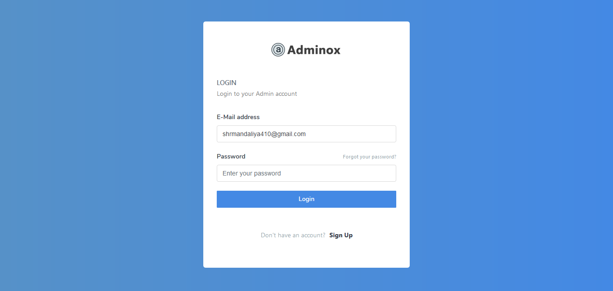

<!-- 

 -->
## Online Shopping Cart

  This website is developed for ecommerce shopping. It will be an online software system which is used to buy product online.

## Features Implemented
-	Any member can register and view available products.
-	Only registered member can purchase multiple products regardless of quantity.
-	Contact Us page is available to contact Admin for queries.
-	There are three roles available:
	-	Visitor, User and Admin.
	-   Visitor can view available products.
	-   User can view and purchase products
	-	An Admin has some extra privilege including all privilege of visitor and user.
		-	Admin can add products, edit product information and add/remove product.
		-	Admin can add user, edit user information and can remove user.
		-	Admin can ship order to user based on order placed by sending confirmation mail.

<!-- - [Simple, fast routing engine](https://laravel.com/docs/routing).
- [Powerful dependency injection container](https://laravel.com/docs/container).
- Multiple back-ends for [session](https://laravel.com/docs/session) and [cache](https://laravel.com/docs/cache) storage.
- Expressive, intuitive [database ORM](https://laravel.com/docs/eloquent).
- Database agnostic [schema migrations](https://laravel.com/docs/migrations).
- [Robust background job processing](https://laravel.com/docs/queues).
- [Real-time event broadcasting](https://laravel.com/docs/broadcasting). -->

<!-- Laravel is accessible, yet powerful, providing tools needed for large, robust applications.
 -->
## Screenshots

###### Login (Desktop)

###### Register

 

###### Products in List View (Desktop)

    <!--  -->
    
    <!--  -->

###### Products in Grid View (Desktop)

   

###### Add to Cart

    
    <!--  -->

<!-- Laravel has the most extensive and thorough [documentation](https://laravel.com/docs) and video tutorial library of any modern web application framework, making it a breeze to get started learning the framework.

If you're not in the mood to read, [Laracasts](https://laracasts.com) contains over 1100 video tutorials on a range of topics including Laravel, modern PHP, unit testing, JavaScript, and more. Boost the skill level of yourself and your entire team by digging into our comprehensive video library.

## Laravel Sponsors

We would like to extend our thanks to the following sponsors for helping fund on-going Laravel development. If you are interested in becoming a sponsor, please visit the Laravel [Patreon page](https://patreon.com/taylorotwell):

- **[Vehikl](https://vehikl.com/)**
- **[Tighten Co.](https://tighten.co)**
- **[British Software Development](https://www.britishsoftware.co)**
- [Fragrantica](https://www.fragrantica.com)
- [SOFTonSOFA](https://softonsofa.com/)
- [User10](https://user10.com)
- [Soumettre.fr](https://soumettre.fr/)
- [CodeBrisk](https://codebrisk.com)
- [1Forge](https://1forge.com)
- [TECPRESSO](https://tecpresso.co.jp/)
- [Pulse Storm](http://www.pulsestorm.net/)
- [Runtime Converter](http://runtimeconverter.com/)
- [WebL'Agence](https://weblagence.com/)

## Contributing

Thank you for considering contributing to the Laravel framework! The contribution guide can be found in the [Laravel documentation](https://laravel.com/docs/contributions).

## Security Vulnerabilities

If you discover a security vulnerability within Laravel, please send an e-mail to Taylor Otwell via [taylor@laravel.com](mailto:taylor@laravel.com). All security vulnerabilities will be promptly addressed.

## License

The Laravel framework is open-sourced software licensed under the [MIT license](https://opensource.org/licenses/MIT).
 -->